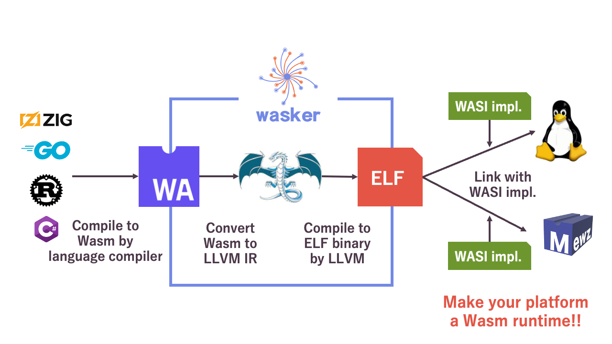
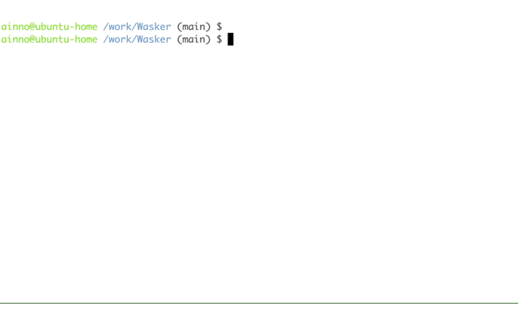

# Wasker

Wasker is a WebAssembly compiler.
Wasker compiles Wasm binary into ELF format binary.　
Currently, Wasker supports WASI preview 1.



## What's new with Wasker

There are already software tools that compile Wasm to native binaries.

What's new with Wasker is, Wasker generates an **OS-independent** ELF file where WASI calls from Wasm applications remain **unresolved**.

This unresolved feature allows Wasker's output ELF file to be **linked with WASI implementations provided by various operating systems**, enabling each OS to execute Wasm applications.

Wasker empowers your favorite OS to serve as a Wasm runtime!


# How to run Wasker
Wasker compiler is based on LLVM (LLVM 15 currently).




## Option1 : Use Docker
Clone repository
```
git clone git@github.com:Mewz-project/Wasker.git
cd Wasker
```

Create directory for mount and place input Wasm/WAT file. 

Please refer [examples](./examples) for building Wasm from Rust and Go. 
Here, as an example, we'll use the already built `helloworld.wat` included in this repository.
```
mkdir -p mount
mv helloworld.wat mount
```

Run Wasker via docker (It may take few minuits to pull image, so you can build image locally by `docker build -t wasker .`)

ELF file will be generated under `mount` directory as `wasm.o`.

```
docker run -it --rm -v $PWD/mount:/work/mount -t ghcr.io/mewz-project/wasker:latest mount/helloworld.wat
[2023-12-28T09:20:27Z INFO  wasker::compiler] input: mount/helloworld.wat
[2023-12-28T09:20:27Z INFO  wasker::compiler] write to wasm.ll
[2023-12-28T09:20:27Z INFO  wasker::compiler] write to wasm.o, it may take a while
[2023-12-28T09:20:28Z INFO  wasker::compiler] Compile success
```

## Option2 : Use Devcontainer
You can try Wasker on browser via Devcontainer.

Start Devcontainer
- Click `Code` -> `Codespaces` -> `New codespace` on this repository page.
- Wait for a while, then you can see VSCode on browser.
- Open terminal on VSCode

Run Wasker
```
cargo run helloworld.wat
```


## Option3 : Build from source
### Clone repository
```
git clone git@github.com:mewz-project/wasker.git
cd Wasker
```

### Install LLVM locally
The commands are a little different because you need an LLVM binary built for your architecture.
#### AMD64
```
mkdir -p dependencies/llvm
wget https://github.com/llvm/llvm-project/releases/download/llvmorg-15.0.0/clang+llvm-15.0.0-x86_64-linux-gnu-rhel-8.4.tar.xz -O /tmp/llvm-15.0.0.tar.xz
tar -xvf /tmp/llvm-15.0.0.tar.xz -C dependencies/llvm
export LLVM_SYS_150_PREFIX=$PWD/dependencies/llvm/clang+llvm-15.0.0-x86_64-linux-gnu-rhel-8.4
```

#### AArch64
```
mkdir -p dependencies/llvm
wget https://github.com/llvm/llvm-project/releases/download/llvmorg-15.0.0/clang+llvm-15.0.0-aarch64-linux-gnu.tar.xz -O /tmp/llvm-15.0.0.tar.xz
tar -xvf /tmp/llvm-15.0.0.tar.xz -C dependencies/llvm
export LLVM_SYS_150_PREFIX=$PWD/dependencies/llvm/clang+llvm-15.0.0-aarch64-linux-gnu
```

### Run Wasker
```
cargo run helloworld.wat
```

# How to use Wasker outputs

ELF file generated by Wasker is OS-independent: WASI calls from Wasm applications remain unresolved.

Please write your own WASI wrapper for your favorite OS to be linked with Wasker output.

Here, we'll show a [tiny example](./examples/wasi-wrapper/wasi-wrapper-linux.c) of running Wasker output on Linux.

Link Wasker output and WASI wapper for Linux
```
gcc -no-pie ./examples/wasi-wrapper/wasi-wrapper-linux.c ./wasm.o -o hello
```

Run!!
```
./hello
```

Also please check [Mewz](https://github.com/Mewz-project/Mewz.git), a unikernel OS which has WASI interface. 
ELF file generated by Wasker can be executed on Mewz without any modification.
