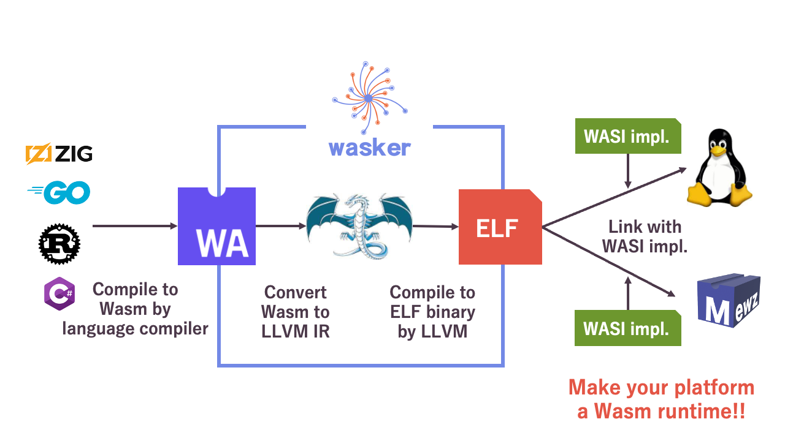
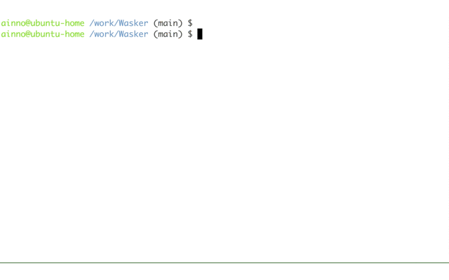

[](https://github.com/mewz-project/wasker/actions/workflows/ci.yaml)


# Wasker

Wasker is a WebAssembly compiler.
Wasker compiles Wasm binary into ELF format binary.　
Currently, Wasker supports WASI preview 1.



## What's new with Wasker

There are already software tools that compile Wasm to native binaries.

What's new with Wasker is, Wasker generates an **OS-independent** ELF file where WASI calls from Wasm applications remain **unresolved**.

This unresolved feature allows Wasker's output ELF file to be **linked with WASI implementations provided by various operating systems**, enabling each OS to execute Wasm applications.

Wasker empowers your favorite OS to serve as a Wasm runtime!




# Quick Start

## Step1: Install Wasker

Download the latest release tarball for your architecture from the [Releases](https://github.com/mewz-project/wasker/releases) page, then install:

```
VERSION=0.2.2
curl -sSfL "https://github.com/mewz-project/wasker/releases/download/v${VERSION}/wasker-${VERSION}-linux-$(uname -m)-musl.tar.gz" \
  | tar -xzvC /usr/bin/ wasker
```

Release binaries are fully static (musl + LLVM built from source). No runtime dependencies are required.

## Step2: Create Wasm binary
Create any Wasm binary.
### example1
Please refer [examples](./examples) for building Wasm from Rust and Go. 

```
git clone https://github.com/mewz-project/wasker.git
cd examples/rust
rustup target add wasm32-wasi
cargo build --target wasm32-wasi
```
### example2
We also provide a pre-built simple Wasm binary.
```
git clone https://github.com/mewz-project/wasker.git
ls helloworld.wat
```

## Step3: Run Wasker to compile Wasm
### example1
```
$ wasker examples/rust/target/wasm32-wasi/debug/rust.wasm
[2024-03-19T12:10:20Z INFO  wasker::compiler] input: examples/rust/target/wasm32-wasi/debug/rust.wasm
[2024-03-19T12:10:20Z INFO  wasker::compiler] write to ./wasm.ll
[2024-03-19T12:10:20Z INFO  wasker::compiler] write to ./wasm.o, it may take a while
[2024-03-19T12:10:21Z INFO  wasker::compiler] Compile success
```

### example2
```
wasker helloworld.wat
```

## Step4: Run compiled Wasm

ELF file generated by Wasker is OS-independent: WASI calls from Wasm applications remain unresolved.

Please write your own WASI wrapper for your favorite OS to be linked with Wasker output.

Here, we'll show a [tiny example](./examples/wasi-wrapper/c/wasi-wrapper-linux.c) of running Wasker output on Linux.

Link Wasker output and WASI wapper for Linux
```
gcc -no-pie ./examples/wasi-wrapper/c/wasi-wrapper-linux.c ./wasm.o -o hello
```

Run!!
```
./hello
```

Also please check [Mewz](https://github.com/Mewz-project/Mewz.git), a unikernel OS which has WASI interface. 
ELF file generated by Wasker can be executed on Mewz without any modification.


# Development
Wasker compiler is based on LLVM (LLVM 22 currently).


## Option1 : Use Devcontainer
You can try Wasker on browser via Devcontainer.

## Option2 : Build from source

Release binaries are fully static and do not depend on the host libc or LLVM packages.
If pre-built binaries do not work on your system, please build from source.

### Clone repository
```
git clone git@github.com:mewz-project/wasker.git
cd Wasker
```

### Install LLVM locally
The commands are a little different because you need an LLVM binary built for your architecture.
You also need development libraries that LLVM links against (`libzstd`, `libxml2`).

#### AMD64
```
mkdir -p dependencies/llvm
wget https://github.com/llvm/llvm-project/releases/download/llvmorg-22.1.8/LLVM-22.1.8-Linux-X64.tar.xz -O /tmp/llvm-22.1.8.tar.xz
tar -xvf /tmp/llvm-22.1.8.tar.xz -C dependencies/llvm
export LLVM_SYS_221_PREFIX=$PWD/dependencies/llvm/LLVM-22.1.8-Linux-X64
# Debian/Ubuntu: sudo apt-get install libzstd-dev libxml2-dev
```

Alternatively, use the Devcontainer (Option 1 above) which installs these dependencies automatically.

#### AArch64
```
mkdir -p dependencies/llvm
wget https://github.com/llvm/llvm-project/releases/download/llvmorg-22.1.8/LLVM-22.1.8-Linux-ARM64.tar.xz -O /tmp/llvm-22.1.8.tar.xz
tar -xvf /tmp/llvm-22.1.8.tar.xz -C dependencies/llvm
export LLVM_SYS_221_PREFIX=$PWD/dependencies/llvm/LLVM-22.1.8-Linux-ARM64
```

### Run Wasker
```
cargo run helloworld.wat
```

